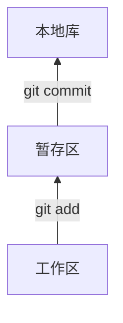

## Git基本介绍

### 优势

- 大部分在本地完成，不需要联网
- 完整性保证
- 尽可能添加数据而不是删除或修改数据
- 分支操作非常快捷流畅
- 与Linux命令全面兼容


### Git结构




### Git和代码托管中心

- 局域网下
  - GitLab服务器
- 互联网下
  - GitHub
  - 码云


### 本地库和远程库


---

## Git命令行操作

初始化本地库

```git
git init
```

设置签名

- 形式

  用户名：xx

  Email：xx

- 作用：区分不同开发人员身份，和远程库的登录账号密码没有联系

- 命令

  - 项目级别/仓库级别：尽在当前本地库范围内有效

    ```
    git config user.name xxx
    git config user.email xxx@xxx.xxx
    ```

    信息保存位置：./.git/config文件

  - 系统用户级别：登录当前操作系统的用户范围

    ```
    git config --global user.name xxx
    git config --global user.email xxx@xxx.xxx
    ```

    信息保存位置：~/.gitconfig文件

  - 项目级别的签名优先级别更高

### 添加提交以及查看状态操作

```
// 状态查看
git status

// 添加 将工作区的 新建/修改 添加到暂存区
git add [file name]
git add .

// 提交操作 
git commit -m "[commit message]" [file name]
git commit -m "[commit message]" -a
```

如果是修改文件而没有添加文件，可以直接commit就可以了

